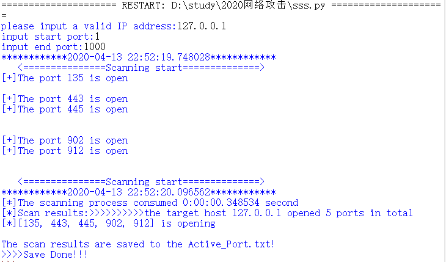
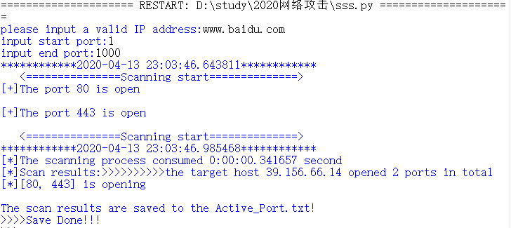
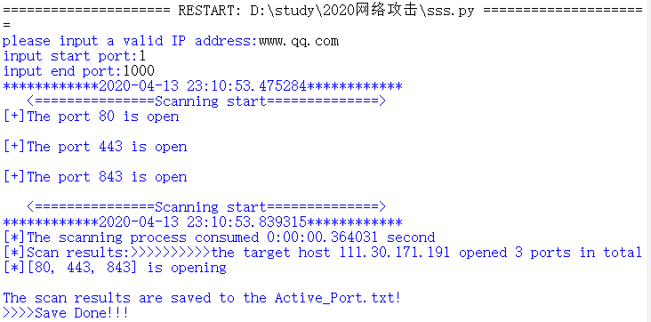
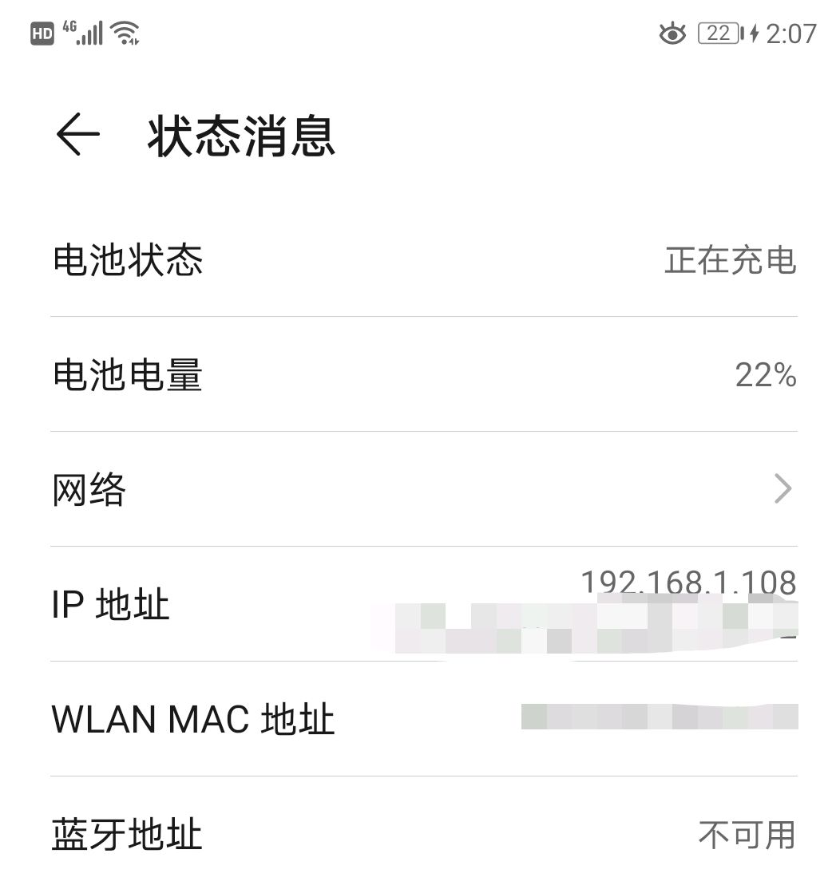
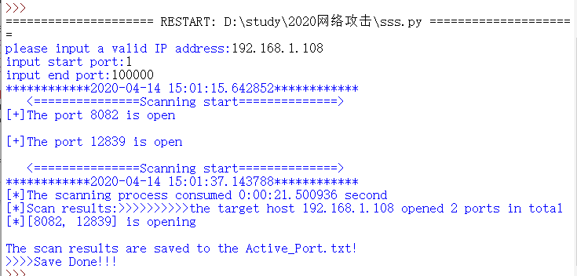
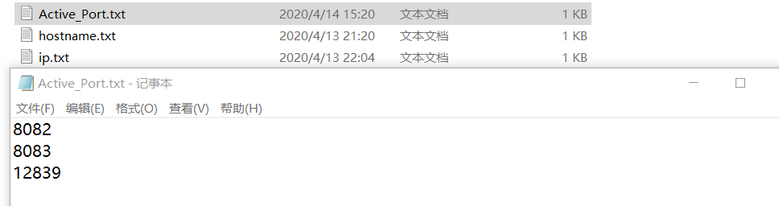

# 端口扫描—TCP Connect()

------
**端口**是英文"port"的意译，可以认为是设备与外界通讯交流的出口。端口可分为虚拟端口和物理端口，其中虚拟端口指计算机内部端口，不可见。例如计算机中的80端口、21端口、23端口等。

一台拥有IP地址的主机可以提供许多服务，比如Web服务、FTP服务、SMTP服务等，这些服务完全可以通过1个IP地址来实现。那么，主机是怎样区分不同的网络服务呢？显然不能只靠IP地址，因为IP 地址与网络服务的关系是一对多的关系。实际上是通过“IP地址+端口号”来区分不同的服务的。

因此，一个开放的端口代表一个提供的服务，不同的服务具有不同的端口号，**因此要对服务进行测试，首先要确定是否开放对应端口号**。常见的TCP端口扫描有：


> * TCP connect()扫描
> * TCP SYN扫描
> * TCP FIN扫描
> * TCP ACK扫描
> * ...

在本次实验中采用的是**TCP connect()扫描**，具体实验内容如下。

### **一、实验原理**
##### **TCP Connect()扫描**
这是最基本的TCP扫描，使用系统提供的conect()函数来连接目标端口，尝试与目的主机的某个端口建立一次完整的三次握手过程，因此这种扫描方式又称为**全扫描**。扫描主机通过TCP/IP协议的三次握手与目标主机的指定端口建立一次完整的连接。连接由系统调用connect开始。如果端口开放，则连接将建立成功；否则，若返回-1则表示端口关闭。
通常情况下，这样做并不需要什么特权，所以几乎所有的用户（包括多用户环境下）都可以通过connect()函数来实现这个操作。

**优点**：简单方便，准确度很高。

**缺点**：容易被防火墙和IDS检测到，并且在目标主机日志会有记录。
### **二、实验要求**
>（1）输入目的IP地址以及端口范围；
>（2）设置获取的用户输入IP地址为远程IP地址；
>（3）从开始端口到结束端口依次扫描，每扫描一个端口创建一个新的套接字
>（4）设置远程地址信息中的端口号为需要扫描的当前端口号；
>（5）连接到当前端口号的目的地址；
>（6）若连接成功（connect()函数返回0）则输出该端口为开启状态，否则输出该端口为关闭状态；         
>（7）关闭当前套接字。

同时满足以下进阶：

 - [ ] 采用**半连接**提高扫描效率。
 - [ ] 使用**多进程**进行端口扫描，进一步提高效率。

### **三、实验代码**


```python
# -*- coding: utf-8 -*-
import threading  # 导入threading包
import datetime
from socket import *
import re

thread = []#线程列表
openNum = 0#处于开放状态的端口数，默认为0
A_port = []#主机存活的端口列表

#TCP connecct()扫描
def PortScaner(host,port):
    global openNum
    s = socket(AF_INET, SOCK_STREAM)  # 创建套接字
    s.settimeout(0.1)#设置socket连接超时，避免socket重复操作
    try:
        s.connect((host,port))
        print('[+]The port %s is open\n' % (port))
        openNum += 1#如果socket连接成功，openNum加1
        A_port.append(port)#讲该端口号添加到主机存活的端口列表中
    except:
        pass   #连接失败
    s.close()

# 利用正则表达式匹配host，判断是否符合IP地址的格式 同时输入不能为空
def ChecK_Host(host):  
    compile_ip = re.compile(
        '^(1\d{2}|2[0-4]\d|25[0-5]|[1-9]\d|[1-9])\.(1\d{2}|2[0-4]\d|25[0-5]|[1-9]\d|\d)\.(1\d{2}|2[0-4]\d|25[0-5]|[1-9]\d|\d)\.(1\d{2}|2[0-4]\d|25[0-5]|[1-9]\d|\d)$')
    if compile_ip.match(host) and len(host) != 0:  # host符合IP地址的格式且不为空值返回True，否则返回False
        return True
    else:
        return False

 #保存扫描结果
def Save_Data(): 
    for i in range(len(A_port)):
        d =str(A_port[i])
        data = open('Active_Port.txt', 'a')
        data.write(d+'\n')
        data.close()

def main():
    hostname = input('please input a valid IP address:')
    host = gethostbyname(hostname)#将给定的主机名解释为一个IP地址
    start = int(input('input start port:'))#起始端口
    end = int(input('input end port:'))#结束端口
    if ChecK_Host(host) and len(host) != 0:
        # 获取开始时间
        Start_Time = datetime.datetime.now()  
        print('*' * 12 + '%s' % Start_Time + '*' * 12)
        print("   <===============Scanning start==============>")
        for port in range(start, end):
            # 创建一个线程，target为线程需要执行的函数，args为函数的参数
            t = threading.Thread(target=PortScaner, args=(host, port))  
            thread.append(t)  # 把线程保存到线程列表
        for t in range(len(thread)):  # 先获取thread线程列表的长度，遍历线程列表
            thread[t].start()  # 运行一个线程，即运行target指定的函数
        for t in range(len(thread)):
            thread[t].join()  # 表示当主进程中断时，所有的线程也会停止执行
        End_Time = datetime.datetime.now()  # 获取结束时间
        Time = End_Time - Start_Time  #得出扫描过程花费的时间
        print("   <===============Scanning start==============>")
        #输出端口扫描结束后的相关结果信息
        print('*' * 12 + '%s' % End_Time + '*' * 12)
        print('[*]The scanning process consumed %s second' % Time)
        print('[*]Scan results:'+'>'*10+'the target host %s opened %s ports in total'%(host,openNum))
        print('[*]%s is opening\n'%A_port)
        print('The scan results are saved to the Active_Port.txt!')
        try:
            Save_Data()
            print('>>>>Save Done!!!')#保存成功
        except:
            print('Save failed!!!')#保存失败
    else:
        #输入IP地址为空或不符合格式
        print('The IP address is invalid,Please input again!!!')
        main()#重新执行main()函数，实现输入错误则重新输入


if __name__ == '__main__':
    main()

```

### **四、运行结果**
#### 1.扫描本主机 ( *127.0.0.1* )


本次扫描的端口范围为**1~1000**，扫描耗时约*0.34s*，其中重要端口含义如下：
>135 端口：DCOM 服务，冲击波病毒利用

>443 端口：基于 TLS/SSL 的网页浏览端口，能提供加密和通过安全端口传输的另一种 HTTP

>445 端口：Microsoft-DS，为共享开放，震荡波病毒利用
#### 2.扫描相关网站 (www.baidu.com 和www.qq.com)
####<https://www.baidu.com>

扫描耗时约*0.34s*

------
####<https://www.qq.com>


本次扫描的端口范围为**1~1000**，扫描耗时约*0.36s*，其中重要端口含义如下：
>80 端口：http,用于网页浏览,木马 Executor 开放此端口

>443端口：基于 TLS/SSL 的网页浏览端口，能提供加密和通过安全端口传输的另一种 HTTP

>843端口：flash发起socket通信请求的时候会先寻找服务器端的843端口
#### 3.扫描手机 
手机的IP地址通过安卓手机端查看可得为“**192.168.1.108**”：

##### 开始扫描


本次扫描的端口范围为**1~100000**，扫描耗时约*21.5s*，其中多次扫描主要端口含义如下：
>8082端口：BlackIce(防止黑客软件)警报发送到此端口

>8083端口：可代理网页与下载文件端口，是一种逻辑端口。

每次扫描结束后，可以通过保存文件进行查看每次扫描的端口

### **五、实验反思**
  本次实验通过端口扫描程序对本主机IP、远程IP以及自己的手机IP进行了**TCP connect()扫描**，刚开始由于未关闭防火墙里dos防护功能中的端口扫描防护，导致扫描结果不理想。同时在对个人手机进行扫描时有时候会出现**扫描不出端口**的情况。通过相关查询可知普通个人手机在进行网络数据传输的时候，会开启端口。但这时，端口处于占用状态。**一旦数据发送或者接受完成，端口就自动关闭**。在这个时间段内，即使扫描工具刚好向这个端口发送数据包，也不会收到响应包。只有Web、文件共享这类服务才会长期开启端口，**启用监听状态**后，才会对发送到该端口的包进行响应。**而普通电脑和手机很少开启这类服务，所以导致扫描不出端口的情况**。
  
  
